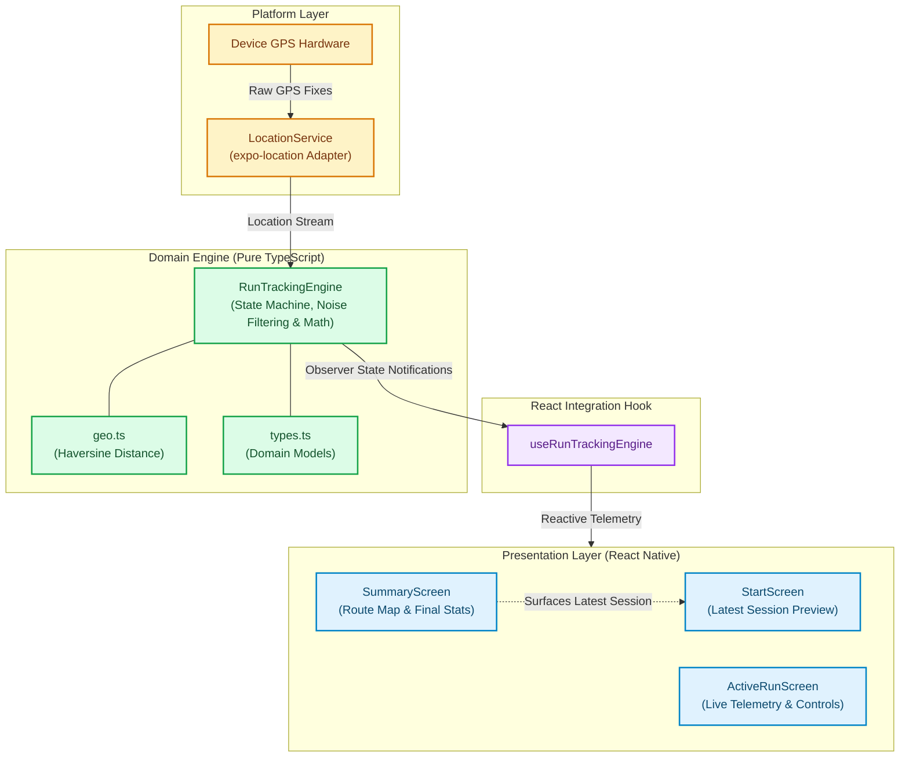

# RUN — Outdoor GPS Running Tracker

A modular, production-grade outdoor running tracker built with **React Native** and **Expo**. Tracks real-time GPS coordinates, filters telemetry noise, computes active duration and average pace, and renders the completed route map summary upon run completion.

---

## Features

- **Live Telemetry:** Real-time monitoring of elapsed duration, cumulative distance in kilometers, and running average pace (`min/km`).
- **State Machine Control:** Deterministic transitions across `idle`, `active`, `paused`, and `finished` states.
- **Defensive GPS Filtering:** Multi-tier filtering pipeline that eliminates erratic jumps, stale fixes, and stationary jitter.
- **Route Visualization:** Renders the runner's exact path on an interactive map using `react-native-maps` polyline rendering.
- **Decoupled Architecture:** Pure TypeScript business logic decoupled from React lifecycle and platform APIs for 100% unit testability.
- **Session Memory:** Retains the latest completed run's metrics (distance, duration, pace) to display on the Start Screen.

---

## Architecture

The system maintains a strict separation of concerns between hardware sensor ingestion, business arithmetic, state management, and UI rendering.



### File Structure and Responsibilities

| File | Purpose |
|---|---|
| [`types.ts`](./types.ts) | Shared domain models and interfaces (`RunPoint`, `RunSummary`, `RunState`, `RawLocation`). |
| [`geo.ts`](./geo.ts) | Pure Haversine distance formula implementation for spherical surface geometry. |
| [`RunTrackingEngine.ts`](./RunTrackingEngine.ts) | Core domain logic: lifecycle state machine, multi-stage GPS filtering, pace, and distance calculations. |
| [`RunTrackingEngine.test.ts`](./RunTrackingEngine.test.ts) | Unit tests verifying GPS noise filtering, edge cases, and math without hardware mocks. |
| [`locationService.ts`](./locationService.ts) | Thin platform adapter managing foreground permissions and streaming raw fixes from `expo-location`. |
| [`useRunTrackingEngine.ts`](./useRunTrackingEngine.ts) | React hook bridging the engine's observer pattern to component re-renders. |
| [`StartScreen.tsx`](./StartScreen.tsx) | Entry view with location permission handling, paracetamol pill start action, and latest session preview. |
| [`ActiveRunScreen.tsx`](./ActiveRunScreen.tsx) | Live dashboard displaying active metrics, run status, and pause/resume/finish controls. |
| [`SummaryScreen.tsx`](./SummaryScreen.tsx) | Post-run review presenting metrics and route visualization over `react-native-maps`. |
| [`App.tsx`](./App.tsx) | Application coordinator managing screen transitions and engine reset lifecycle. |

---

## Distance and Pace Calculations

Consumer GPS receivers inherently produce noise, reflection artifacts, and accuracy fluctuations. Raw fixes are evaluated against four validation filters before contributing to route and distance metrics:

1. **Horizontal Accuracy Cutoff:** Fixes reporting an accuracy uncertainty greater than `20 meters` are rejected.
2. **Staleness Rejection:** Updates with a timestamp older than `5 seconds` relative to receipt time are discarded.
3. **Speed Spike Filter:** Fixes that imply an instantaneous velocity exceeding `6.5 m/s` (faster than `2:34 min/km` pace) are rejected as teleportation or GPS multipath errors.
4. **Stationary Jitter Suppression:** Displacements below `2 meters` while moving at near-zero velocity are excluded to prevent artificial distance accumulation when stationary.

### Metrics Arithmetic

* **Average Pace:** Evaluated as a running average (`total active duration / total distance`), updated once per second. This provides stable readability and eliminates fluctuations inherent to noisy instantaneous speed readings.
* **Active Duration:** Computed from system timestamps (`current timestamp - start timestamp - total paused time`). This prevents timer drift caused by JavaScript execution throttling.

---

## Getting Started

### Prerequisites

- Node.js (v18 or higher)
- npm or yarn
- **Expo Go** installed on an iOS or Android physical device

### Installation

1. Clone the repository:
   ```bash
   git clone https://github.com/SahebSandhuSingh/PlexQo.git
   cd PlexQo
   ```

2. Install dependencies:
   ```bash
   npm install
   ```

3. Start the development server:
   ```bash
   npx expo start
   ```
   *(Use `npx expo start --tunnel` if testing across different Wi-Fi networks or cellular data).*

4. Scan the generated QR code:
   - **iOS:** Scan using the default Camera app (opens in Expo Go).
   - **Android:** Scan within the Expo Go app.

> **Testing Guidance:** Accurate verification of GPS tracking requires outdoor testing on a physical mobile device. Simulators and emulators do not emit realistic GPS accuracy variations unless explicit location paths are simulated.

---

## Running Tests

Automated unit tests validate engine state transitions, point rejection criteria, and calculation accuracy without hardware dependencies:

```bash
npx jest
```

---

## Engineering Decisions and Trade-offs

* **Zero Navigation Overhead:** Screen switching is managed with a lightweight state coordinator in `App.tsx`. Pulling in heavy third-party routing libraries like `@react-navigation/native` was intentionally avoided to keep the bundle footprint minimal for a focused 3-screen workflow.
* **Foreground GPS vs. Background Tracking:** Configured for foreground updates compatible with standard Expo Go deployments (`NSLocationWhenInUseUsageDescription`). Full background execution requires an EAS standalone build with background location entitlements.
* **GPS Telemetry vs. Step Counting:** Outdoor running distance is calculated via GPS rather than accelerometer step counting, as step estimation requires individual stride calibration and yields inferior accuracy for outdoor running.
* **In-Memory Session Architecture:** Runs are processed in-memory during app execution, and the latest completed session is retained in state and highlighted on the Start Screen. Heavy persistent databases were avoided to maintain zero-overhead performance.
